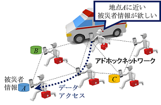

# アドホックネットワーク

## 構成員

-------

* 原 隆浩（教授）
* 天方 大地（助教）

## アドホックネットワークとは

-------

近年の無線通信技術の発展と計算機の小型化に伴い、ユーザが携帯型の計算機（移動体）を持ち歩き、時間や場所に関係なくネットワークに接続できる移動体計算環境が普及しつつあります。
特に、ルータ機能をもつ移動体のみで一時的なネットワークを形成するアドホックネットワークへの関心が高まっています。
アドホックネットワークでは、直接パケットを送受信できない移動体間において、その間に存在する移動体がパケットを中継することで、マルチホップ通信を実現します。
このように、アドホックネットワークでは、既存の通信基盤を必要とせずに移動体同士で自律的にネットワークを構築できるため、緊急災害時の救助活動や車車間通信、センサネットワークへの利用が期待されています。
しかしアドホックネットワークでは、移動体の移動によりネットワークトポロジが動的に変化するため、従来の固定ネットワークとは異なる基盤技術が必要になります。

## 研究テーマ

-------

### 位置ベースの高度な検索

-------
スマートフォン等の移動体が普及し、より多くのユーザにより、広い領域でアドホックネットワークを構築する環境が整いつつあります。
このような場合には、ユーザの現在の位置やユーザの興味のある位置に関連する情報を知りたいというような、位置に基づいたサービスが求められます。
例えば災害救助の際、ある被災地点周辺の被災者の情報をアドホックネットワークを用いて取得することができれば、効果的な救助活動を行うことができます。
しかし、広い領域に分散的に存在している多くの移動体（ユーザ）や移動体の保持するデータから、ユーザの興味がある位置に関連するデータや該当するユーザの情報を効果的に収集することは、簡単ではありません。
私達の研究グループでは、このようなアドホックネットワーク上での位置ベースの高度な検索を効率的に実現する方法について検討しています。
特に、ユーザの指定した位置から距離の近いk個の移動体やデータを検索する、k最近傍検索や、ユーザの周辺に存在する移動体を継続して把握（モニタリング）するための効率的な手法に関しての研究を行っています。

### 検索活動に対する攻撃の検出（セキュリティ）

---

アドホックネットワークではマルチホップ通信を行うため、基本的にパケットはいくつかの移動体を中継して送信されます。アドホックネットワーク上で必要なデータの検索を行う際、中継の移動体が外部からの攻撃により攻撃端末となってしまうと、必要なデータを正しく中継せず、検索を行ったユーザが必要なデータを取得できなくなる可能性があります。私達の研究グループでは、アドホックネットワーク上での検索の際に問題となる新しい攻撃を提唱し、この攻撃に耐性のある検索手法について研究しています。この検索手法は、たとえ攻撃端末が必要なデータを正しく中継しなくても、ユーザは必要なデータを取得でき、他の移動体からの情報により攻撃の検知や攻撃端末の特定ができるように設計しています。

## 主な研究業績

-------

### 論文

1. Komai, Y., Sasaki, Y., Hara, T., and Nishio, S.: k Nearest Neighbor Search for Location-Dependent Sensor Data in MANETs, IEEE Access, Vol. 3, No. 1, pp. 942-954 (Dec. 2015).
2. Komai, Y., Sasaki, Y., Hara, T., and Nishio, S.:kNN Query Processing Methods in Mobile Ad Hoc Networks, IEEE Transactions on Mobile Computing, Vol. 13, No. 5, pp. 1090-1103 (May 2014).

### 国際会議

1. Tsuda, T., Komai, Y., Hara, T., and Nishio, S.: Signature-Based Top-K Query Processing Against Data Replacement Attacks in MANETs, Proc. of International Symposium on Reliable Distributed Systems (SRDS 2015), pp. 130-139 (Sept. 2015).
2. Komai, Y., Hara, T., and Nishio, S.: Processing Convex Hull Queries in MANETs, Proc. of International Conference on Mobile Data Management (MDM 2015), pp. 64-73 (June 2015).
3. Amagata, D., Sasaki, Y., Hara, T., and Nishio, S.: A Robust Routing Method for Top-k Queries in Mobile Ad Hoc Networks, Proc. of International Conference on Mobile Data Management (MDM 2013), pp, 251-256 (June 2013).