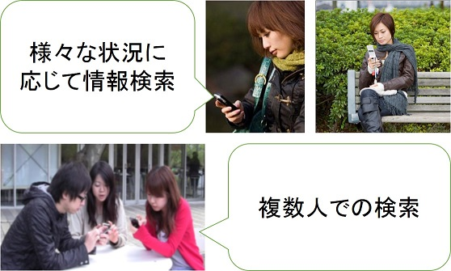

# コンテンツ

## 構成員
-------
* 原 隆浩（教授）
* 前川 卓也（准教授）
* 白川 真澄（招聘教員）

## 研究テーマ：モバイルWeb
-------
近年のスマートフォンの普及と，通信技術の発展に伴い，モバイル端末を用いてWWW(World Wide Web)上の情報を検索したり，様々なアプリケーションを利用して必要な情報を得ることが一般的になりつつあります．しかし，莫大な情報を含むWWWから必要な情報を適切に検索したり，マーケット上に存在する大量なアプリケーションの中から，ユーザが必要とするアプリケーションを探しだすことは困難です．モバイル端末を用いる環境では，ユーザの置かれている状況が様々であり，ユーザの必要とする情報は，ユーザ自身の行動や周辺情報などの状況（コンテキスト）によって変化するといった特徴があります．

また，複数のユーザがそれぞれのモバイル端末を用い，同じ目的を持って協調検索を行うことが多くなりました．しかし，既存のWeb検索サービスやアプリケーションは，個人で利用することを想定して設計されているため，効率的に協調検索を行うことは困難です．

私たちの研究グループでは，モバイル端末を用いた快適な検索環境や情報推薦を提供するための研究を推進しています．例えば，ユーザの行動（歩いている，座っているなど）に合わせた検索の支援，複数人による協調検索の支援，コンテキスト（時間，場所など）に基づいた情報推薦といったテーマに取り組んでいます．

## 研究テーマ：ロケーションプライバシ
-------
GPS受信機能を搭載した携帯端末の普及に伴い，周辺の施設の検索等，ユーザの位置情報を利用した位置情報サービスが数多く提供されています．位置情報サービスではユーザは自身の位置情報をサービスプロバイダに送る必要がありますが，この位置データが第三者に露見することによって，住所などの個人情報が明らかになってしまう危険性があります．このようなユーザの位置情報に関連したプライバシ（ロケーションプライバシ）を保護するための研究への関心が高まっています．

私たちの研究グループでは，実環境における地理的，物理的な制約，及びユーザの行動傾向を考慮することで，より実用的なロケーションプライバシ保護手法に関する研究を推進しています．ユーザ歩行時のダミー生成手法，ユーザが自動車で移動する際のダミー生成手法などを実現しています．

## 研究テーマ：Wikipedia & Webマイニング
-------
近年，WWW上に公開される情報が爆発的に増加したことに伴い，必要な情報を見つけることが困難となっています．Webマイニングは，このように増加の一途をたどるWeb空間を解析することで有益な情報を抽出する研究の総称です．Webマイニングは非常に広い研究領域であり，必要な情報をWeb空間から効率良く収集するためのクローリング戦略や，集めたデータを集積するインデックス化処理，リンク構造解析（PageRank，HITS），コンテンツ内容の解析，ログ解析など，多くの研究領域から構成されています．

私たちの研究グループでは，大量のWebコンテンツを解析することで有用な知識を抽出することにより，計算機により高度な知識を与える研究を推進しています．協調型Web辞典マイニング（Wikipediaマイニング）やソーシャルネットワーク解析は，私たちの研究グループの主な研究です．私たちの研究グループでは，Webコンテンツの特性を考慮した解析手法を提案し，より大規模なデータ解析手法を提案することで，スケーラビリティと高い精度を兼ね備えたシソーラス辞書構築手法などを実現しています．

## 主な研究業績
-------
### 論文

1. Masumi Shirakawa, Kotaro Nakayama, Takahiro Hara, and Shojiro Nishio, "Wikipedia-Based Semantic Similarity Measurements for Noisy Short Texts Using Extended Naive Bayes," IEEE Transactions on Emerging Topics in Computing, volume 3, number 2, pages 205-219, June 2015.
1. Takuya Sugitani, Masumi Shirakawa, Takahiro Hara, and Shojiro Nishio, "A Method for Detecting Local Events Using the Spatiotemporal Locality of Microblog Posts," Int'l Journal of Web Information Systems (IJWIS) , volume 11, number 1, pages 2-16, May 2015.
1.  加藤 諒, 岩田 麻佑, 原 隆浩, 鈴木 晃祥, 荒瀬 由紀, Xing Xie, 西尾 章治郎, "停止するユーザの移動経路に基づいた位置プライバシ保護のためのダミー生成手法," 情報処理学会論文誌, volume 55, number 1, pages 505-518, 2014年1月.

### 国際会議
1. Masumi Shirakawa, Takahiro Hara, and Shojiro Nishio, "N-Gram IDF: a Global Term Weighting Scheme Based on Information Distance," Proc. of Int'l World Wide Web Conf. (WWW 2015), pages 960-970, May 2015.
1. Masumi Shirakawa, Takahiro Hara, and Shojiro Nishio, "MLJ: Language-Independent Real-Time Search of Tweets Reported by Media Outlets and Journalists," Proc. of Int'l Conf. on Very Large Data Bases (VLDB 2014), pages 1605-1608, September 2014.
1.  Ryo Kato, Mayu Iwata, Takahiro Hara, Akiyoshi Suzuki, Yuki Arase, Xing Xie, and Shojiro Nishio, "A Dummy-Based Anonymization Method Based on User Trajectory with Pauses," Proc. of Int'l Conf. on Advances in Geographic Information Systems (GIS 2012), pages 249-258, November 2012.
